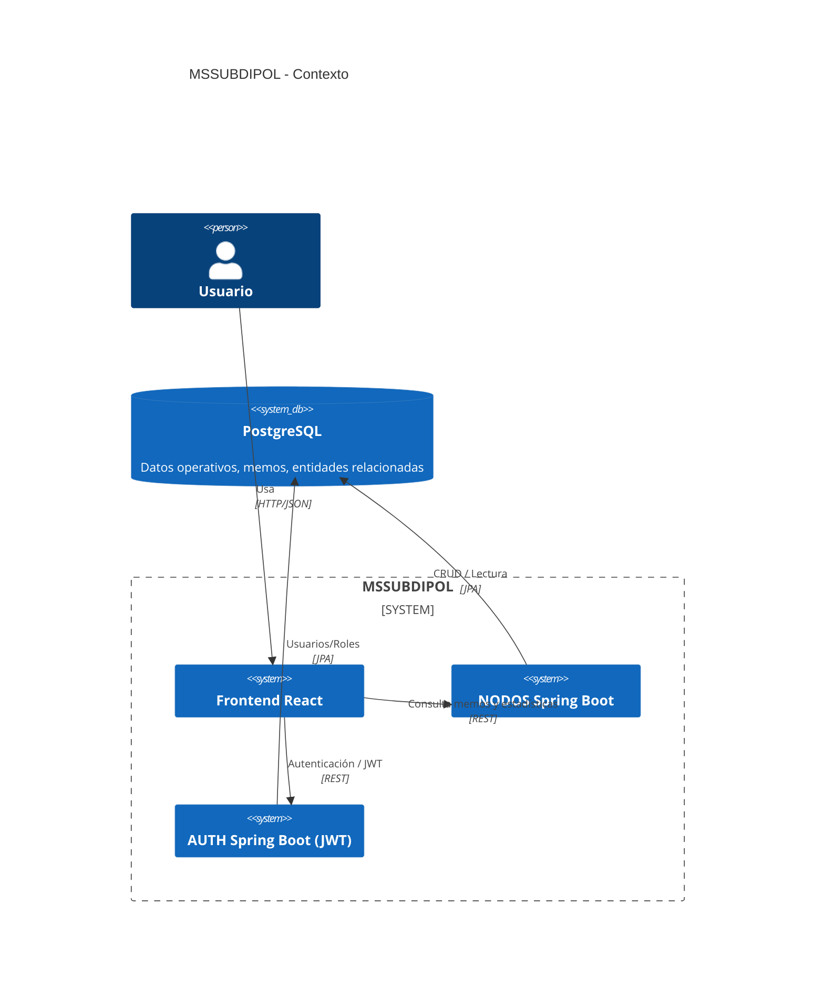
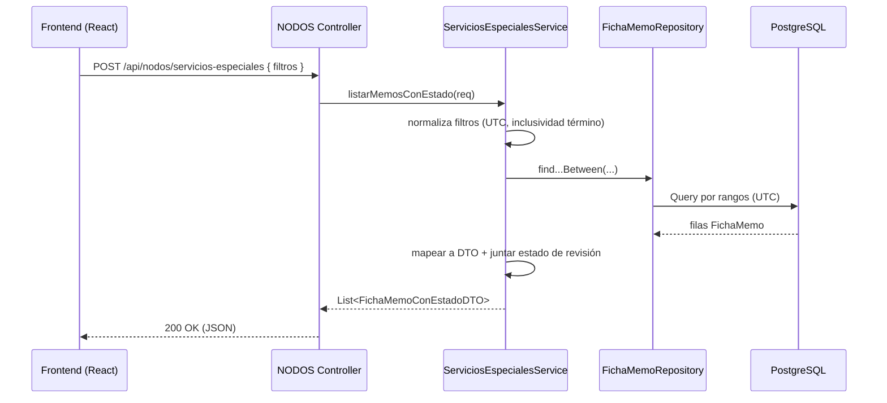

# Arquitectura del Sistema

Este documento describe la arquitectura de alto nivel del sistema MSSUBDIPOL, sus módulos, flujos y decisiones principales.

## Visión general
- Arquitectura modular con servicios Spring Boot (nodos, auth) y un frontend React.
- Persistencia en PostgreSQL (timestamps UTC) y acceso mediante Spring Data JPA.
- Despliegue contenedorizado con Docker y orquestación simple con docker-compose.

## Diagrama de arquitectura

## Módulos
- Frontend: UI, navegación, tablas, filtros de fecha con zona horaria local, cliente HTTP (axios).
- NODOS (backend): Controladores REST, Servicios, Repositorios y DTOs de consulta. Manejo consistente de fechas en UTC.
- AUTH: Autenticación y autorización (JWT). Endpoints de login y gestión de roles/permisos.
- Otros módulos: commonservices, formularios, turnos (ver docs/modules/).

## Backend NODOS: estructura Spring Boot
- Controllers: `cl.investigaciones.nodos.controller.consulta` (p.ej., `ServiciosEspecialesController`)
- Services: `cl.investigaciones.nodos.service.consulta` (p.ej., `ServiciosEspecialesService`, `EstadisticasService`)
- Repositories: `cl.investigaciones.nodos.repository.consulta` (p.ej., `FichaMemoRepository`)
- DTOs: `cl.investigaciones.nodos.dto.*` (consultas, exportaciones)
- Domain entities: `cl.investigaciones.nodos.domain.entidadesconsulta.*`

### Flujo típico de consulta de memos

## Consideraciones de diseño clave
- Fechas en UTC en la BD; el frontend envía instantes ISO-8601 con offset (Z). El backend usa OffsetDateTime y normaliza a UTC para consultar.
- Inclusividad del límite superior: si el picker entrega precisión a minutos, el servicio ajusta el final al último nanosegundo del minuto.
- Separación de responsabilidades: Controller delgado, Service concentra reglas, Repository modela consultas declarativas.
- Carga asociada: consultas por ID hacen fetch de personas y estados para minimizar N+1.

## Decisiones: Spring Boot vs Django
- Reutilización de infraestructura Java y conocimientos internos.
- Integración JPA y consultas complejas apoyadas por Spring Data.
- Ecosistema de seguridad (filtros JWT). Ver docs/modules/auth.md y SecurityConfig.

